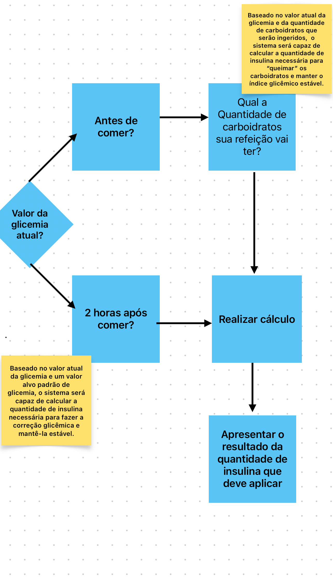

# S.C.G 
> Sistema para Controle Glicêmico.

## Tecnologias utilizadas🚀 

| Nome   | Descrição                  |
| ---------- |  --------------------- |
| Bulma.io | Framework de estilização frontend   |
| Jquery   |  Framework javascript   |
| Typed.js   |  Framework para efeito de digitação  |

## Diagrama 🖼️
> Fluxograma do funcionamento
</img>
